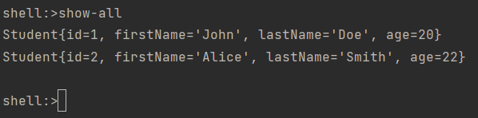
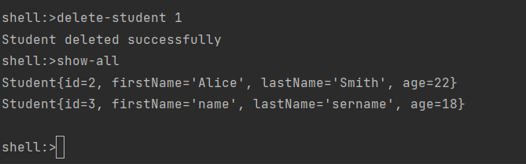
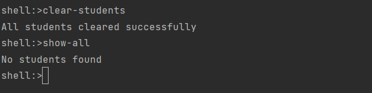

# StudentRegistration

### Команды: 
<li>"show-all" - показать всех студентов</li>
  

<li>"add-student --firstName name --lastName sername --age 18" - добавить студента</li>
  

<li>"delete-student 1" - удалить студента,где 1 это id студента</li>
  

<li>"clear-students" - удаление всех студентов</li>
  

