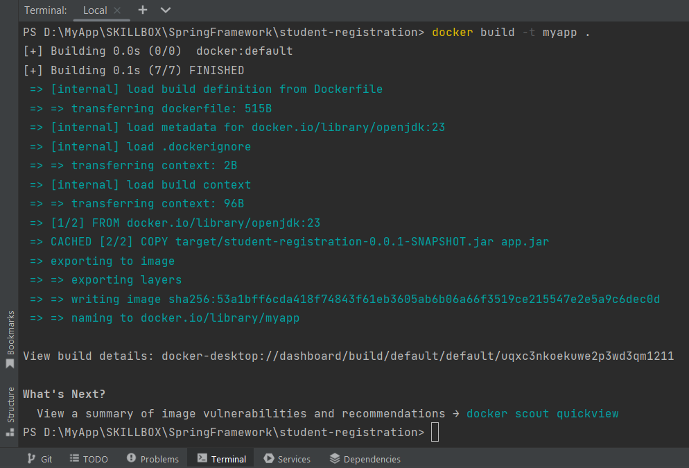

# StudentRegistration

<h3>Создание докер-образа</h3>
  
Для создания образа нужно ввести команду "docker build -t myapp ." - где "myapp" имя образа.

  

  <h3>Запуск докер-образа</h3>
  
Для запуска контейнера нужно ввести команду "docker run -it myapp" - где "myapp" имя образа.

  

Команды приложения: 
<li>"show-all" - показать всех студентов</li>
  

<li>"add-student --firstName name --lastName sername --age 18" - добавить студента</li>
  

<li>"delete-student 1" - удалить студента,где 1 это id студента</li>
  

<li>"clear-students" - удаление всех студентов</li>
  

